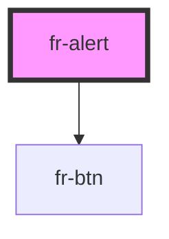

# fr-alert

<!-- Auto Generated Below -->

## Properties

| Property              | Attribute              | Description                                                                                          | Type                             | Default     |
| --------------------- | ---------------------- | ---------------------------------------------------------------------------------------------------- | -------------------------------- | ----------- |
| `alertId`             | `alert-id`             | En combinaison avec l'attribut closableCollapsible inserér un alert-id pour l'attribut aria-controls | `string`                         | `undefined` |
| `closable`            | `closable`             | Ajoute un bouton de fermeture                                                                        | `boolean`                        | `undefined` |
| `closableCollapsible` | `closable-collapsible` | Alerte refermable dans un collapse                                                                   | `boolean`                        | `undefined` |
| `small`               | `small`                | Alerte au format petit                                                                               | `boolean`                        | `undefined` |
| `title`               | `title`                | Titre de l'alerte                                                                                    | `string`                         | `undefined` |
| `type`                | `type`                 | Aspect de l'alerte: default \| info \| error \| success                                              | `"error" \| "info" \| "success"` | `undefined` |

## Dependencies

### Depends on

- [fr-btn](../button)

### Graph

----------------------------------------------

*Built with [StencilJS](https://stenciljs.com/)*
