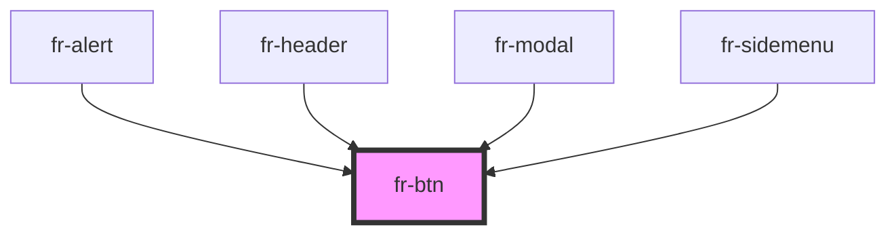

# fr-button

<!-- Auto Generated Below -->

## Properties

| Property        | Attribute         | Description                                                                | Type                   | Default     |
| --------------- | ----------------- | -------------------------------------------------------------------------- | ---------------------- | ----------- |
| `btnNavMenu`    | `btn-nav-menu`    | header button menu                                                         | `boolean`              | `false`     |
| `btnNavSearch`  | `btn-nav-search`  | header button search                                                       | `boolean`              | `false`     |
| `buttonTitle`   | `button-title`    | The title of button.                                                       | `string`               | `undefined` |
| `close`         | `close`           | If `true`, fr-link--close added                                            | `boolean`              | `false`     |
| `disabled`      | `disabled`        | If `true`, the user cannot interact with the button.                       | `boolean`              | `false`     |
| `fullWidth`     | `full-width`      | If `true`, the button has a width=100%                                     | `boolean`              | `undefined` |
| `iconOnly`      | `icon-only`       | If `true`, all scss for a button without text with only icon will be apply | `boolean`              | `undefined` |
| `modalOpenerId` | `modal-opener-id` | the id of the modal button                                                 | `string`               | `undefined` |
| `size`          | `size`            | The button size.                                                           | `"lg" \| "sm"`         | `undefined` |
| `state`         | `state`           | The state of the button.                                                   | `"secondary"`          | `undefined` |
| `textPosition`  | `text-position`   | The text position of button.                                               | `"center" \| "right"`  | `undefined` |
| `type`          | `type`            | The type of button.                                                        | `"button" \| "submit"` | `'button'`  |

## Events

| Event   | Description                          | Type                |
| ------- | ------------------------------------ | ------------------- |
| `blur`  | Emitted when the button loses focus. | `CustomEvent<void>` |
| `focus` | Emitted when the button has focus.   | `CustomEvent<void>` |

## Dependencies

### Used by

 - [fr-alert](../alert)
 - [fr-header](../header)
 - [fr-modal](../modal)
 - [fr-sidemenu](../side-menu)

### Graph

----------------------------------------------

*Built with [StencilJS](https://stenciljs.com/)*
