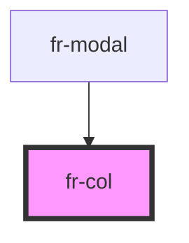

# fr-col

<!-- Auto Generated Below -->

## Properties

| Property        | Attribute         | Description                | Type                                                          | Default     |
| --------------- | ----------------- | -------------------------- | ------------------------------------------------------------- | ----------- |
| `align`         | `align`           | Alignment                  | `"bottom" \| "middle" \| "top"`                               | `undefined` |
| `offset`        | `offset`          | Offset                     | `1 \| 10 \| 11 \| 12 \| 2 \| 3 \| 4 \| 5 \| 6 \| 7 \| 8 \| 9` | `undefined` |
| `offsetLg`      | `offset-lg`       | Offset lg breakpoint       | `1 \| 10 \| 11 \| 12 \| 2 \| 3 \| 4 \| 5 \| 6 \| 7 \| 8 \| 9` | `undefined` |
| `offsetMd`      | `offset-md`       | Offset md breakpoint       | `1 \| 10 \| 11 \| 12 \| 2 \| 3 \| 4 \| 5 \| 6 \| 7 \| 8 \| 9` | `undefined` |
| `offsetRight`   | `offset-right`    | Right offset               | `1 \| 10 \| 11 \| 12 \| 2 \| 3 \| 4 \| 5 \| 6 \| 7 \| 8 \| 9` | `undefined` |
| `offsetRightLg` | `offset-right-lg` | Right offset lg breakpoint | `1 \| 10 \| 11 \| 12 \| 2 \| 3 \| 4 \| 5 \| 6 \| 7 \| 8 \| 9` | `undefined` |
| `offsetRightMd` | `offset-right-md` | Right offset md breakpoint | `1 \| 10 \| 11 \| 12 \| 2 \| 3 \| 4 \| 5 \| 6 \| 7 \| 8 \| 9` | `undefined` |
| `offsetRightSm` | `offset-right-sm` | Right offset sm breakpoint | `1 \| 10 \| 11 \| 12 \| 2 \| 3 \| 4 \| 5 \| 6 \| 7 \| 8 \| 9` | `undefined` |
| `offsetRightXl` | `offset-right-xl` | Right offset xl breakpoint | `1 \| 10 \| 11 \| 12 \| 2 \| 3 \| 4 \| 5 \| 6 \| 7 \| 8 \| 9` | `undefined` |
| `offsetSm`      | `offset-sm`       | Offset sm breakpoint       | `1 \| 10 \| 11 \| 12 \| 2 \| 3 \| 4 \| 5 \| 6 \| 7 \| 8 \| 9` | `undefined` |
| `offsetXl`      | `offset-xl`       | Offset xl breakpoint       | `1 \| 10 \| 11 \| 12 \| 2 \| 3 \| 4 \| 5 \| 6 \| 7 \| 8 \| 9` | `undefined` |
| `width`         | `width`           | Width                      | `1 \| 10 \| 11 \| 12 \| 2 \| 3 \| 4 \| 5 \| 6 \| 7 \| 8 \| 9` | `undefined` |
| `widthLg`       | `width-lg`        | Width lg breakpoint        | `1 \| 10 \| 11 \| 12 \| 2 \| 3 \| 4 \| 5 \| 6 \| 7 \| 8 \| 9` | `undefined` |
| `widthMd`       | `width-md`        | Width md breakpoint        | `1 \| 10 \| 11 \| 12 \| 2 \| 3 \| 4 \| 5 \| 6 \| 7 \| 8 \| 9` | `undefined` |
| `widthSm`       | `width-sm`        | Width sm breakpoint        | `1 \| 10 \| 11 \| 12 \| 2 \| 3 \| 4 \| 5 \| 6 \| 7 \| 8 \| 9` | `undefined` |
| `widthXl`       | `width-xl`        | Width xl breakpoint        | `1 \| 10 \| 11 \| 12 \| 2 \| 3 \| 4 \| 5 \| 6 \| 7 \| 8 \| 9` | `undefined` |

## Dependencies

### Used by

 - [fr-modal](../modal)

### Graph

----------------------------------------------

*Built with [StencilJS](https://stenciljs.com/)*
