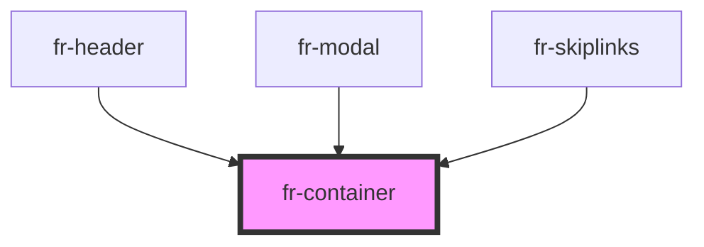

# fr-container

<!-- Auto Generated Below -->

## Properties

| Property     | Attribute     | Description | Type      | Default |
| ------------ | ------------- | ----------- | --------- | ------- |
| `fluid`      | `fluid`       | Fluid       | `boolean` | `false` |
| `fullHeight` | `full-height` |             | `boolean` | `false` |

## Dependencies

### Used by

 - [fr-header](../header)
 - [fr-modal](../modal)
 - [fr-skiplinks](../skiplinks)

### Graph

----------------------------------------------

*Built with [StencilJS](https://stenciljs.com/)*
