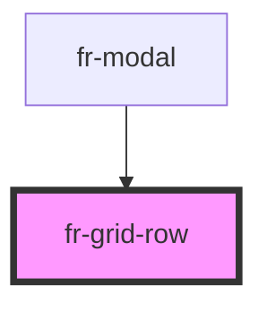

# fr-grid-row

<!-- Auto Generated Below -->

## Properties

| Property    | Attribute    | Description      | Type                            | Default     |
| ----------- | ------------ | ---------------- | ------------------------------- | ----------- |
| `align`     | `align`      | Alignment        | `"bottom" \| "middle" \| "top"` | `undefined` |
| `gutters`   | `gutters`    | With gutters     | `boolean`                       | `false`     |
| `justify`   | `justify`    | Justification    | `"center" \| "left" \| "right"` | `undefined` |
| `noGutters` | `no-gutters` | Reset no gutters | `boolean`                       | `false`     |

## Dependencies

### Used by

 - [fr-modal](../modal)

### Graph

----------------------------------------------

*Built with [StencilJS](https://stenciljs.com/)*
