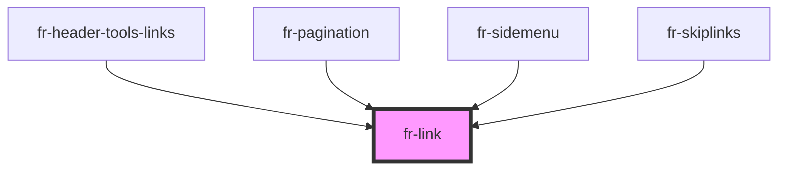

# fr-link

<!-- Auto Generated Below -->

## Properties

| Property         | Attribute          | Description                                                                                                                   | Type           | Default     |
| ---------------- | ------------------ | ----------------------------------------------------------------------------------------------------------------------------- | -------------- | ----------- |
| `alignOnContent` | `align-on-content` | Align on content                                                                                                              | `boolean`      | `false`     |
| `chip`           | `chip`             | Chip                                                                                                                          | `boolean`      | `false`     |
| `href`           | `href`             | Contains a URL or a URL fragment that the hyperlink points to. If this property is not set, a disabled link will be rendered. | `string`       | `undefined` |
| `newWindow`      | `new-window`       | Specifies whether to display the linked URL in new tab or window. Only applies when an `href` is provided.                    | `boolean`      | `false`     |
| `raw`            | `raw`              | Raw link                                                                                                                      | `boolean`      | `false`     |
| `reset`          | `reset`            | Reset link                                                                                                                    | `boolean`      | `false`     |
| `size`           | `size`             | Size                                                                                                                          | `"lg" \| "sm"` | `undefined` |
| `target`         | `target`           | Target                                                                                                                        | `string`       | `undefined` |

## Slots

| Slot          | Description                                                           |
| ------------- | --------------------------------------------------------------------- |
|               | Content is placed between the named slots if provided without a slot. |
| `"icon-only"` | Should be used on an icon in a link that has no text.                 |
| `"left"`      | Content is placed to the left of the link text.                       |
| `"right"`     | Content is placed to the right of the link text.                      |

## Dependencies

### Used by

 - [fr-header-tools-links](../header/header-tools)
 - [fr-pagination](../pagination)
 - [fr-sidemenu](../side-menu)
 - [fr-skiplinks](../skiplinks)

### Graph

----------------------------------------------

*Built with [StencilJS](https://stenciljs.com/)*
