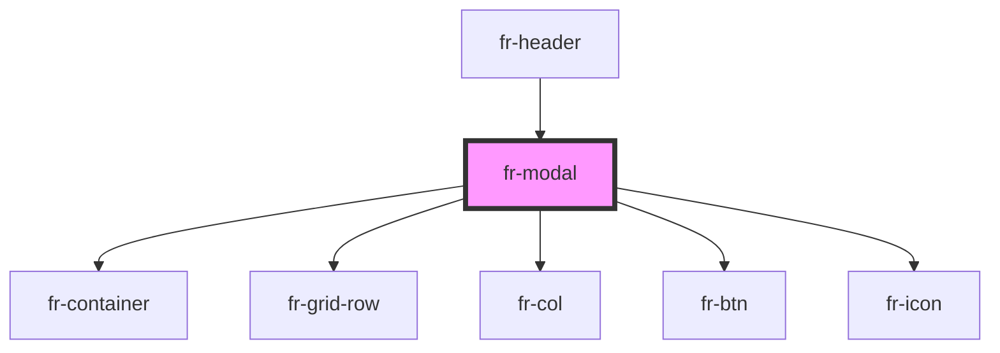

# fr-modal

<!-- Auto Generated Below -->

## Properties

| Property            | Attribute      | Description       | Type           | Default     |
| ------------------- | -------------- | ----------------- | -------------- | ----------- |
| `frId` _(required)_ | `fr-id`        | Unique identifier | `string`       | `undefined` |
| `frTitle`           | `fr-title`     | Title             | `string`       | `undefined` |
| `headerModal`       | `header-modal` | full              | `boolean`      | `false`     |
| `size`              | `size`         | Size              | `"lg" \| "sm"` | `undefined` |
| `top`               | `top`          | Stack at top      | `boolean`      | `false`     |

## Dependencies

### Used by

 - [fr-header](../header)

### Depends on

- [fr-container](../container)
- [fr-grid-row](../grid-row)
- [fr-col](../col)
- [fr-btn](../button)
- [fr-icon](../icon)

### Graph

----------------------------------------------

*Built with [StencilJS](https://stenciljs.com/)*
