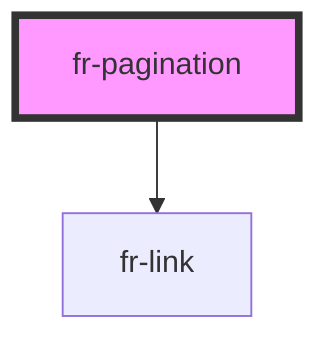

# fr-pagination

<!-- Auto Generated Below -->

## Properties

| Property                  | Attribute      | Description                                                                                                                                  | Type     | Default     |
| ------------------------- | -------------- | -------------------------------------------------------------------------------------------------------------------------------------------- | -------- | ----------- |
| `currentPage`             | `current-page` | Page en cours de visualisation dans le paginateur                                                                                            | `number` | `1`         |
| `pagesTotal` _(required)_ | `pages-total`  | Nombre de pages à gérer par le composant                                                                                                     | `number` | `undefined` |
| `urlPattern` _(required)_ | `url-pattern`  | Va générer les href des boutons à partir du pattern fourni -> urlPattern concaténé avec le numéro de page par le composant string urlPattern | `string` | `undefined` |

## Dependencies

### Depends on

- [fr-link](../links)

### Graph

----------------------------------------------

*Built with [StencilJS](https://stenciljs.com/)*
