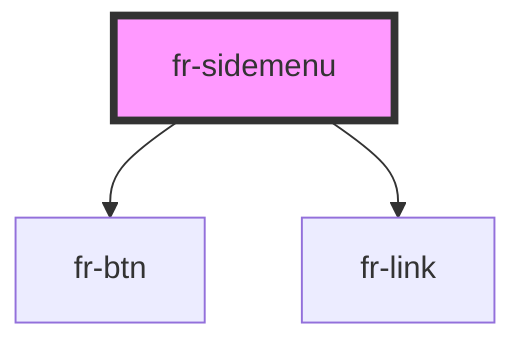

# fr-sidemenu

<!-- Auto Generated Below -->

## Properties

| Property          | Attribute     | Description              | Type      | Default     |
| ----------------- | ------------- | ------------------------ | --------- | ----------- |
| `dataType`        | `data-type`   |                          | `string`  | `"xml"`     |
| `hasBorders`      | `borders`     | Menu has borders(css)    | `boolean` | `undefined` |
| `isFloatingRight` | `float-right` | Menu floating right(css) | `boolean` | `undefined` |
| `isFullHeight`    | `full-height` | Menu full height(css)    | `boolean` | `undefined` |
| `isSticky`        | `sticky`      | Menu Sticky(css)         | `boolean` | `undefined` |
| `menuTitle`       | `title`       | Titre du menu latéral    | `string`  | `undefined` |

## Dependencies

### Depends on

- [fr-btn](../button)
- [fr-link](../links)

### Graph

----------------------------------------------

*Built with [StencilJS](https://stenciljs.com/)*
