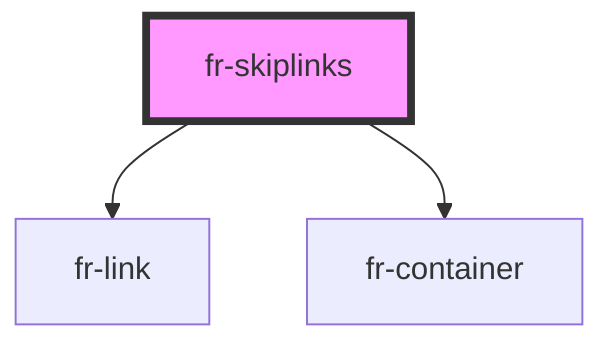

# fr-skiplinks

<!-- Auto Generated Below -->

## Properties

| Property | Attribute | Description | Type              | Default |
| -------- | --------- | ----------- | ----------------- | ------- |
| `links`  | --        |             | `LinkInterface[]` | `[]`    |

## Dependencies

### Depends on

- [fr-link](../links)
- [fr-container](../container)

### Graph

----------------------------------------------

*Built with [StencilJS](https://stenciljs.com/)*
