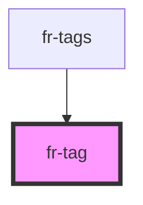

# fr-tag

<!-- Auto Generated Below -->

## Properties

| Property | Attribute | Description | Type      | Default     |
| -------- | --------- | ----------- | --------- | ----------- |
| `href`   | `href`    |             | `string`  | `undefined` |
| `label`  | `label`   |             | `string`  | `undefined` |
| `sm`     | `sm`      |             | `boolean` | `undefined` |

## Dependencies

### Used by

 - [fr-tags](../tags)

### Graph

----------------------------------------------

*Built with [StencilJS](https://stenciljs.com/)*
